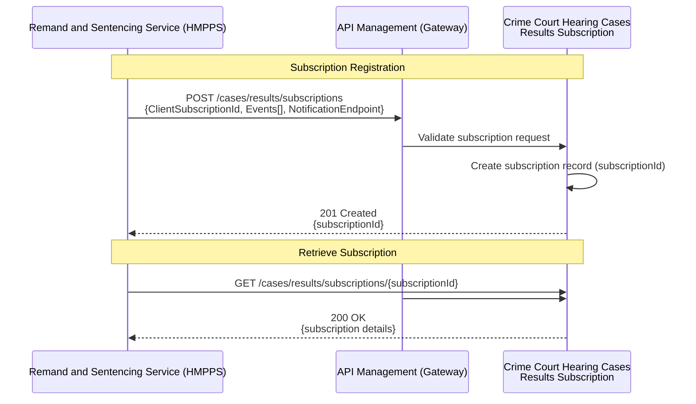
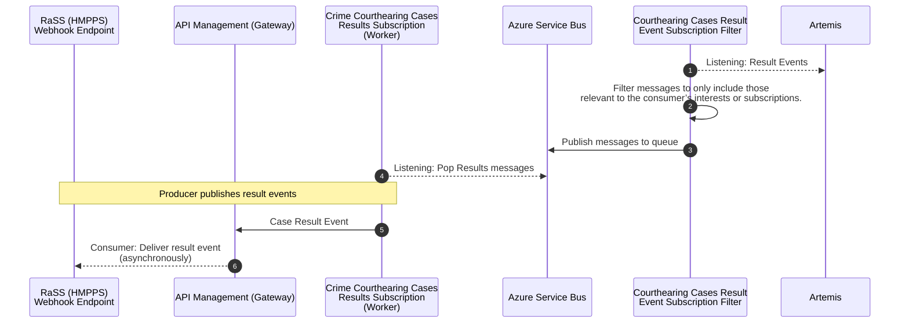
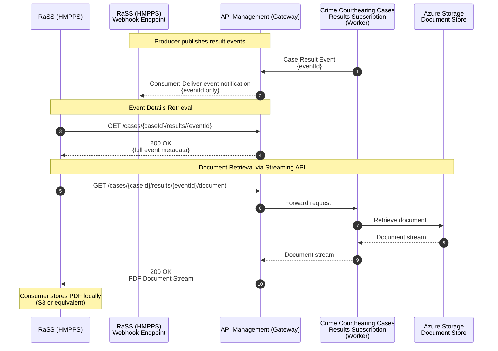
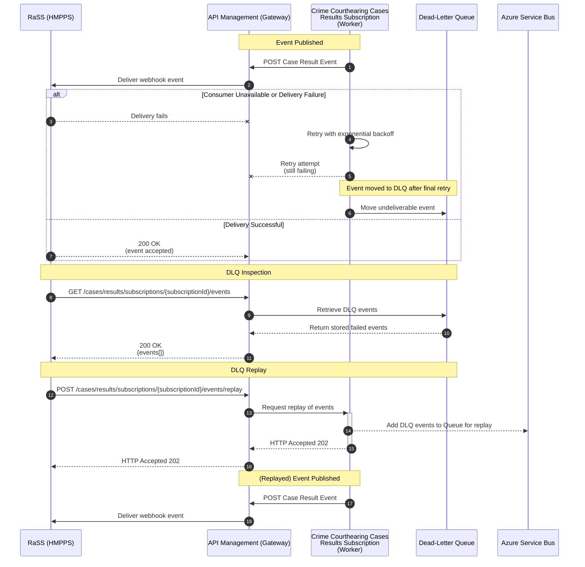

# Criminal Court Result Subscription API – Functional Requirements (Draft)

Producer: HMCTS Common Platform

Consumer: **Initial** consumer Remand and Sentence Service (RaSS)

Version: Draft 0.1

Status: For discussion

## Purpose of the API

The Criminal Courts (Magistrate and Crown) Result Subscription API provides a standardised, reusable mechanism for HMCTS
to publish custody-relevant case result events to authorised justice partners.

While the initial consumer is the Prisons Remand and Sentencing Service (RaSS), the API is intentionally designed as a
multi-consumer event distribution pattern that can support wider cross-justice needs (e.g. DWP, Probation, Police, Victims Services).

The API enables:
* Event-based notifications when HMCTS records or amends a custody-impacting court result.
* Structured metadata describing the event so consumers can automate workflow decisions.
* A consistent document access model, providing a URL for retrieving the current source-of-truth court documents (e.g. PDF warrants, in early phases).
* A scalable subscription model that aligns with the HMCTS API Marketplace, allowing future consumers to onboard without bespoke integrations.

### Initial Use Case: RaSS Warrant Ingestion

The initial use case for this API is to support RaSS in automating the ingestion of custodial warrants and sentencing documents from HMCTS.

This work replaces part of the existing email-based warrant distribution process — which contributes to operational errors,
including Releases in Error — and provides a modern, event-driven foundation for safer and more consistent data sharing between courts and prisons.

Email delivery will run in parallel during early adoption to minimise operational risk during transition.

## Event-Based Subscription and Publishing Model

The API must support a subscription-based event model where consumers can register to receive custody-relevant result events via webhooks.

HMCTS must publish result events whenever:
* A new custodial outcome occurs.
* An amended custodial result is recorded (treated identically to “create”).

### Subscription Registration

`POST /cases/results/subscriptions`

```json
{
    "ClientSubscriptionId": "string",
    "Events": ["ResultEventType", "..."],
    "NotificationEndpoint": {
      "WebhookUrl": "https://consumer.gov.uk/hooks/case-events",
      "Auth": "string"
    }
}
```

Response:
```json
{
  "subscriptionId": "{UUID}"
}
```

(TBC) Event Payload Must Include:
* Case ID
* Defendant ID
* PNC ID (if present)
* Event timestamp
* Custody relevance flag
* Metadata describing the result/warrant

These events will ultimately replace the existing email “action point”.

### Webhook Delivery Requirements

* Consumer must provide HTTPS POST endpoint.
* API Marketplace will sign webhook deliveries (HMAC header).
* Consumer must return 2xx to acknowledge.
* Retries managed by Worker with exponential backoff - 3 tries over 15 minutes.
* Failures routed to DLQ - DLQs will be kept per subscription for 28 days, then they will be purged.

### Subscription Retrieval

Retrieve all subscriptions for the consumer

`GET /cases/results/subscriptions`

Response:
```json
{
    "subscriptions": [
        {
          "THE_SUBSCRIPTION_ID": ["ResultEventType", "..."]
        },
        {
          "ANOTHER_SUBSCRIPTION_ID": ["ResultEventType", "..."]
        }
    ]
}
```

Retrieve a specific subscription

`GET /cases/results/subscriptions/{subscriptionId}`

Response:
```json
    {
      "subscriptions": [
        {
          "THE_SUBSCRIPTION_ID": ["ResultEventType", "..."]
        }
      ]
    }
```

#### Sequence Diagrams: Subscription Registration and Retrieval



## Subscription Event Delivery & Document Retrieval



## Authentication

### API Authentication

All API requests require authentication using OAuth 2.0 client credentials flow:

1. **Client Registration**: Common Platform registers the consumer application (e.g., RaSS) in Microsoft Entra ID and provides the client ID and secret
2. **Token Acquisition**: Clients obtain an access token from Common Platform Microsoft Entra ID using their client ID and secret
3. **Token Usage**: Include the access token in the `Authorization` header as a Bearer token
4. **Token Refresh**: Tokens have a limited lifetime; clients must refresh before expiry

### Token Validation

API Management (Gateway) validates all incoming tokens using the built-in `validate-jwt` policy before forwarding requests to backend services. Validation is performed locally using cached public keys from Microsoft Entra ID (JWKS endpoint):

1. **Signature Verification**: Validates the token signature against cached Microsoft Entra ID public keys
2. **Expiry Check**: Rejects expired tokens (validates `exp` claim)
3. **Issuer Validation**: Confirms the `iss` claim matches Common Platform Microsoft Entra ID tenant
4. **Audience Validation**: Confirms the `aud` claim matches this API's application ID

Invalid tokens are rejected with HTTP 401 Unauthorized.

**APIM Policy Example:**
```xml
<inbound>
    <validate-jwt header-name="Authorization" failed-validation-httpcode="401">
        <openid-config url="https://login.microsoftonline.com/{tenant-id}/v2.0/.well-known/openid-configuration" />
        <audiences>
            <audience>{api-application-id}</audience>
        </audiences>
        <issuers>
            <issuer>https://login.microsoftonline.com/{tenant-id}/v2.0</issuer>
        </issuers>
    </validate-jwt>
</inbound>
```

### Webhook Authentication

When delivering events to consumer webhook endpoints (e.g., RaSS), Common Platform must authenticate using the mechanism specified by HMPPS. See: https://ministryofjustice.github.io/hmpps-integration-api/authentication.html

HMPPS requires two complementary authentication methods:

1. **Mutual TLS (mTLS)**: Common Platform must present a TLS certificate issued by HMPPS when making webhook requests
2. **API Key**: Include an `x-api-key` HTTP header containing the API key provided by HMPPS (not Base64 encoded)

**Setup Process:**
1. HMPPS issues a TLS certificate and API key to Common Platform
2. Common Platform stores these credentials securely (e.g., Azure Key Vault)
3. When delivering webhook events, Common Platform presents the TLS certificate and includes the API key header

**Security Requirements:**
- All communication over TLS 1.2 or higher
- Credentials must be stored securely (e.g., Azure Key Vault)
- Rotate credentials periodically
- Log authentication failures for security monitoring


# *******************************************************************
# TODO: THE BELOW IS A SEPARATE API DEFINITION - MOVE TO CORRECT REPO
# *******************************************************************


### Document Retrieval Process

After receiving an event, the consumer (RaSS) will:
1.	Receive webhook POST event containing only the event ID.
2.	MVP behaviour:
3.  * Query AMP to retrieve full event details via: `GET /cases/{case_id}/results/{event_id}`
    * **NOTE:** the underlying service must only allow retrieval of subscription-relevant events.
3.	Request the document via the streaming API: `GET /cases/{case_id}/results/{event_id}/document`



Future enhancements will expand JSON payload richness so prisons rely less on PDFs.

**Important Note:**
The PDF remains the operational currency today.
Until the operational process changes, this must remain part of the producer–consumer relationship.

#### Document Retrieval Requirements

* Documents must not be embedded in any JSON event payload.
* API provides a streaming endpoint for document retrieval: `GET /cases/{case_id}/results/{event_id}/document`
* HMCTS document storage remains the source of truth.
* Prisons will store a local copy (AWS S3) to support their workflow automation.

**Benefits**

* Digital transfer supports prisoner movement between establishments.
* Reduces the amount of repeated document requests to HMCTS.
* Provides traceability and reduces “missing document” incidents.

### Reliability & Failure Handling

The existing email process offers no delivery guarantee.

The API must support:

Delivery Guarantees
* Retry with exponential backoff
* Dead-letter queue (DLQ) for undeliverable events
* Ability for consumers to inspect DLQs
* Ability for consumers to replay DLQs once systems recover

#### DLQ Inspection

`GET /cases/results/subscriptions/{subscriptionId}/events`

#### DLQ Replay

`POST /cases/results/subscriptions/{subscriptionId}/events/replay`

This strictly aligns replay with the subscription that owns the events.



## Event Filtering Requirements

RaSS must only receive events relevant to custodial processing.

Event Types the API Should Support:
* Custodial outcomes
* Bail from custody
* Events that change a prisoner’s legal status

Events RaSS does NOT want:
* Full case data
* All court events
* Civil or non-custodial results

The API must surface only custody-impacting result events.

## Requirements for Updates / Amendments

API Requirements
* Every amendment must generate a new event
* Updates treated the same as creates (idempotent notification model)
* The API must always allow retrieval of the latest document version

## Security Requirements

The new system must:
* Use secure authentication (OAuth2 preferred long-term)
* Provide authenticated document streaming API (no signed URLs)
* Enforce strong audit trails and access controls
* Never embed PDFs directly in event payloads
* Ensure privacy and integrity of custody-related data

## Additional Future Considerations

* Discoverable list of event types: GET /cases/results/event-types
* Potential expansion to other justice partners (DWP, Probation)
* Multi-consumer patterns enabled via API Marketplace

## Next Steps

* Align subscription model with API Marketplace standards
* Define authentication model for all consumer but initially for RaSS (temporary → long-term OAuth2)
* Produce OpenAPI v1.0 draft
  * Including event schema for MVP


