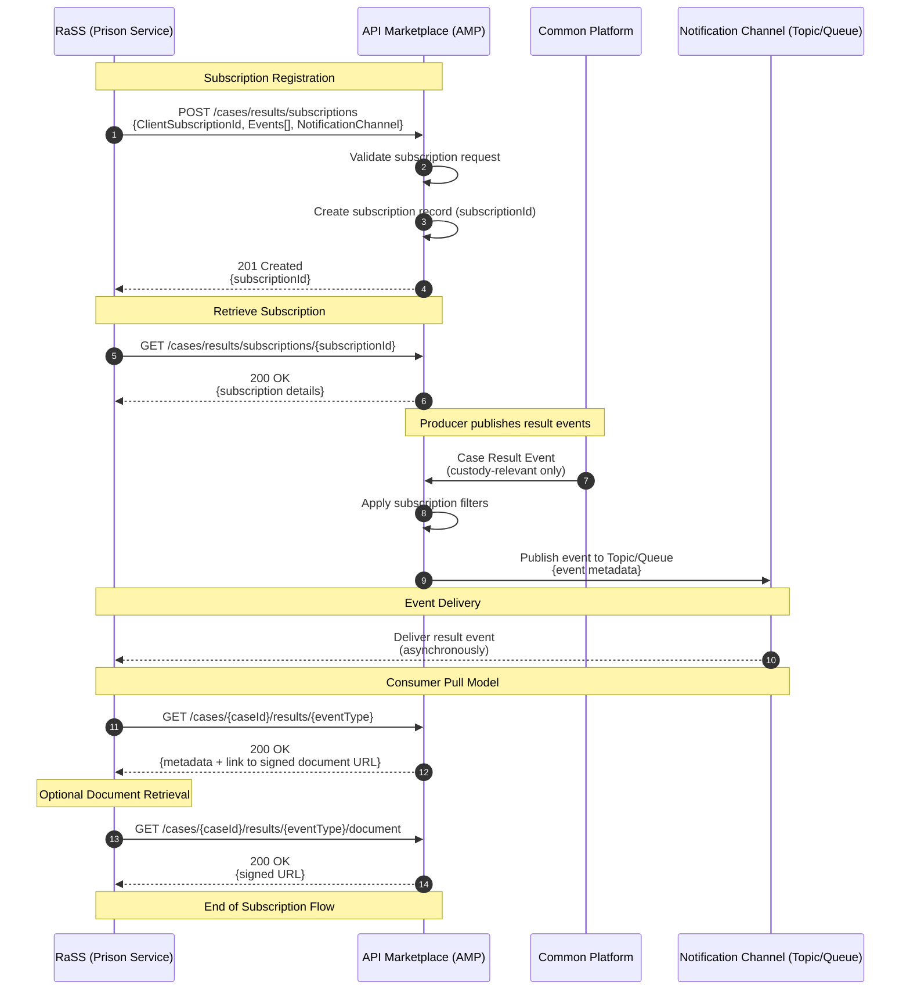

# Court Case Result Subscription API – Functional Requirements (Draft)

Consumer: Initial consumer Remand and Sentence Service (RaSS)
Producer: HMCTS Common Platform
Version: Draft 0.1
Status: For discussion

## Purpose of the API

The Prisons Case Result Event API replaces the current email-based process for sending custodial warrants and sentencing documents from HMCTS to Prisons.
This manual process contributes to approximately 100 releases in error per year.

The API will:
* Notify Prisons when a custody-relevant event occurs (e.g. result created or updated).
* Provide structured metadata and a reference to retrieve associated documents (PDF warrants).
* Enable Prisons (RaSS) to fetch documents programmatically to drive automated workflow actions.

Email delivery will run in parallel during the early adoption phase to eliminate operational risk.

## Functional Requirements

### Event-Based Notification Model

HMCTS must publish case result events whenever:
* A new custodial outcome occurs.
* An amended custodial result is recorded (treated identically to “create”).

Subscription Request (Illustrative)
```json
POST /cases/results/subscriptions
{
    "ClientSubscriptionId": "string",
    "Events": ["ResultEventType", "..."],
    "NotificationChannel": {
        "Role": "string",
        "Topic": "string"
    }
}
```

Response:
```json
{
  "subscriptionId": "{UUID}"
}
```

Event Payload Must Include:
* Case ID
* Defendant ID
* PNC ID (if present)
* Event timestamp
* Custody relevance flag
* Metadata describing the result/warrant

These events will ultimately replace the existing email “action point”.

### Subscription Retrieval

Retrieve all subscriptions

`GET /cases/results/subscriptions`

Response:
```json
{
    "subscriptions": [
        {
          "subscriptionId": ["ResultEventType", "..."]
        }
    ]
}
```

Retrieve a specific subscription

`GET /cases/results/subscriptions/{subscriptionId}`

Response:
```json
    {
      "subscriptions": [
        {
          "subscriptionId": ["ResultEventType", "..."]
        }
      ]
    }
```




### Consumer Pull Model

After receiving an event, the consumer (RaSS) will:
1.	Receive notification through the subscribed channel (topic).
2.	MVP behaviour:
* Request the event details and a “document link pointer” via:
`GET /cases/{case_id}/results/{result_event_type}`
3.	Follow the URL to obtain a signed URL for the PDF warrant document.

Future enhancements will expand JSON payload richness so prisons rely less on PDFs.

**Important Note:**
The PDF remains the operational currency today.
Until the operational process changes, this must remain part of the producer–consumer relationship.

### Document Retrieval Requirements

* Documents must not be embedded in any JSON event payload.
* API returns metadata and a signed URL for the PDF.
* HMCTS document storage remains the source of truth.
* Prisons will store a local copy (AWS S3) to support their workflow automation.

**Benefits**

* Digital transfer supports prisoner movement between establishments.
* Reduces the amount of repeated document requests to HMCTS.
* Provides traceability and reduces “missing document” incidents.

### Reliability & Failure Handling

The existing email process offers no delivery guarantee.

The API must support:

Delivery Guarantees
* Retry with exponential backoff
* Dead-letter queue (DLQ) for undeliverable events
* Ability for consumers to inspect DLQs
* Ability for consumers to replay DLQs once systems recover

### DLQ Inspection

`GET /cases/results/subscriptions/{subscriptionId}/events`

### DLQ Replay

`POST /cases/results/subscriptions/{subscriptionId}/events/replay`

This strictly aligns replay with the subscription that owns the events.

## Event Filtering Requirements

RaSS must only receive events relevant to custodial processing.

Event Types the API Should Support:
* Custodial outcomes
* Bail from custody
* Events that change a prisoner’s legal status

Events RaSS does NOT want:
* Full case data
* All court events
* Civil or non-custodial results

The API must surface only custody-impacting result events.

## Requirements for Updates / Amendments

API Requirements
* Every amendment must generate a new event
* Updates treated the same as creates (idempotent notification model)
* The API must always allow retrieval of the latest document version

## Security Requirements

The new system must:
* Use secure authentication (OAuth2 preferred long-term)
* Provide time-limited signed URLs for documents
* Enforce strong audit trails and access controls
* Never embed PDFs directly in event payloads
* Ensure privacy and integrity of custody-related data

## Additional Future Considerations

* Discoverable list of event types: GET /cases/results/event-types
* Potential expansion to other justice partners (DWP, Probation)
* Multi-consumer patterns enabled via API Marketplace

## Next Steps

* Finalise event schema for MVP
* Align subscription model with API Marketplace standards
* Define authentication model for all consumer but initially for RaSS (temporary → long-term OAuth2)
* Produce sequence diagrams for:
  * Event publication
  * Document retrieval
  * DLQ replay
* Produce OpenAPI v1.0 draft
